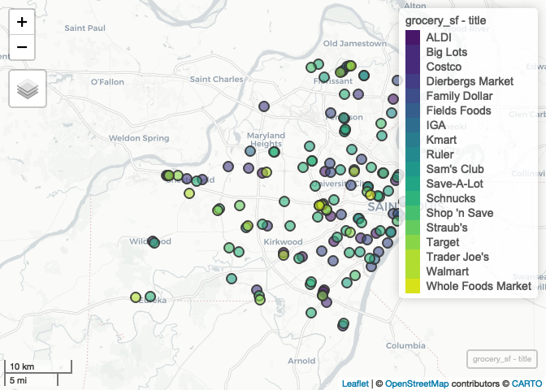

Lab-D-Replication
================
Christopher Prener, Ph.D.
(April 27, 2020)

## Introduction

This notebook replicates the Lab-D assignment, which geocodes the
locations of chain grocery stores in St. Louis City and County.

## Dependencies

This notebook requires the following packages:

``` r
# tidyverse packages
library(dplyr)       # data wrangling
```

    ## 
    ## Attaching package: 'dplyr'

    ## The following objects are masked from 'package:stats':
    ## 
    ##     filter, lag

    ## The following objects are masked from 'package:base':
    ## 
    ##     intersect, setdiff, setequal, union

``` r
library(readr)       # read csv files
library(stringr)     # data wrangling for strings
library(tidyr)       # data wrangling for tables

# spatial packages
library(censusxy)    # geocoding
library(mapview)     # preview spatial data
library(sf)          # spatial tools
```

    ## Linking to GEOS 3.7.2, GDAL 2.4.2, PROJ 5.2.0

``` r
# other packages
library(here)        # file path management
```

    ## here() starts at /Users/prenercg/GitHub/slu-soc5650/lecture-d/assignments/lab-d-replication

## Load Data

This notebook requires raw data on grocery store locations:

``` r
grocery <- read_csv(here("data", "STL_RETAIL_Grocery.csv"))
```

    ## Parsed with column specification:
    ## cols(
    ##   id = col_double(),
    ##   title = col_character(),
    ##   address = col_character()
    ## )

## Part 1

### Question 1

First, we need to pre-process our data and parse the address colum by:

1.  Parsing the zip code into its own column, **then**
2.  deleting the zip code from the `address` column, **then**
3.  removing trailing spaces, **then**
4.  parsing the remaining address data.

<!-- end list -->

``` r
grocery %>%
  mutate(zip = word(address, -1)) %>% # extract zip code
  mutate(address = str_replace(string = address, pattern = zip, replacement = "")) %>% # delete zip code in address
  mutate(address = str_squish(address)) %>% # remove trailing space
  separate(col = "address", into = c("street", "city", "state"), sep = ",") -> grocery # parse
```

We now have data that can be geocoded\!

### Question 2

Now, we’ll geocode our address
data:

``` r
grocery_geocode <- cxy_geocode(grocery, id = "id", street = "street", city = "city", state = "state", zip = "zip")
```

Notice that we have a lot of `NA` values - this is far less than ideal.
Geocoding often takes extensive work to prep and clean our data.

### Question 3

Finally, we’ll project them using NAD 1983:

``` r
grocery_geocode %>%
  filter(is.na(cxy_lon) == FALSE) %>%
  st_as_sf(coords = c("cxy_lon", "cxy_lat"), crs = 4269) -> grocery_sf
```

We can preview our data that we could geocode with `mapview`:

``` r
mapview(grocery_sf, zcol = "title")
```

<!-- -->
