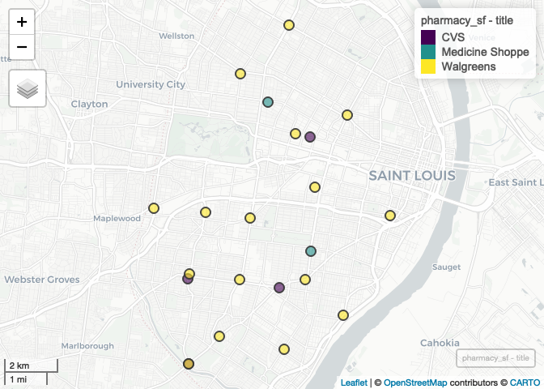

Lecture-D Examples Complete
================
Your Name
(April 27, 2020)

## Introduction

This notebook introduces concepts related to geocoding using `R`.

## Install Additional Dependency

Our geocoding package, `censusxy`, needs to be installed:

``` r
remotes::install_github("slu-openGIS/censusxy")
```

## Dependencies

This notebook requires the follwing packages:

``` r
# tidyverse packages
library(dplyr)       # data wrangling
```

    ## 
    ## Attaching package: 'dplyr'

    ## The following objects are masked from 'package:stats':
    ## 
    ##     filter, lag

    ## The following objects are masked from 'package:base':
    ## 
    ##     intersect, setdiff, setequal, union

``` r
library(readr)       # read csv files
library(stringr)     # data wrangling for strings
library(tidyr)       # data wrangling for tables

# spatial packages
library(censusxy)    # geocoding
library(mapview)     # preview spatial data
library(sf)          # spatial tools
```

    ## Linking to GEOS 3.7.2, GDAL 2.4.2, PROJ 5.2.0

``` r
# other packages
library(here)        # file path management
```

    ## here() starts at /Users/prenercg/GitHub/slu-soc5650/lecture-d

## Load Data

This notebook requires two data
sets:

``` r
pharmacy <- read_csv(here("data", "example-data", "STL_RETAIL_Pharmacy.csv"))
```

    ## Parsed with column specification:
    ## cols(
    ##   id = col_double(),
    ##   title = col_character(),
    ##   address = col_character()
    ## )

``` r
pharmacy_simple <- read_csv(here("data", "example-data", "STL_RETAIL_Pharmacy_Simple.csv"))
```

    ## Parsed with column specification:
    ## cols(
    ##   id = col_double(),
    ##   title = col_character(),
    ##   address = col_character()
    ## )

## Preparing Data for Geocoding

Geocoders need data that have been pre-processed into separate columns.
Sometimes data come this way, other times they do not. The sample data
have a common configuration with the entire street address in a single
string.

### Simple Case

In the simple case, each of the major parts are separated by a comma:
street, city, state, and zip. In our `pharmacy_simple` data, our data
follow this convention:

``` r
pharmacy_simple
```

    ## # A tibble: 23 x 3
    ##       id title           address                                 
    ##    <dbl> <chr>           <chr>                                   
    ##  1     1 CVS             3925 Lindell Blvd, St Louis, MO, 63108  
    ##  2     2 CVS             4100 Gravois Ave, St Louis, MO, 63116   
    ##  3     3 CVS             4255 Hampton Ave, St Louis, MO, 63109   
    ##  4     4 CVS             7320 Gravois Ave, St Louis, MO, 63116   
    ##  5     5 Medicine Shoppe 3137 S Grand Blvd, St Louis, MO, 63118  
    ##  6     6 Medicine Shoppe 625 N Euclid Ave, St Louis, MO, 63108   
    ##  7     7 Walgreens       1225 Union Blvd, St Louis, MO, 63113    
    ##  8     8 Walgreens       1400 N Grand Blvd, St Louis, MO, 63106  
    ##  9     9 Walgreens       1530 Lafayette Ave, St Louis, MO, 63104 
    ## 10    10 Walgreens       2310 McCausland Ave, St Louis, MO, 63143
    ## # … with 13 more rows

We can use the `tidyr` package’s `separate()` function to parse these
data:

``` r
pharmacy_simple <- separate(pharmacy_simple, col = "address", into = c("street", "city", "state", "zip"), sep = ",")
```

This is useful for illustrating how `separate()` works, and introducing
the idea of parsing street addresses. However, it isn’t realistic for
most US data.

### Realistic Case

In the US, most human-entered data omits the final comma between states
and zip-codes. This makes the parsing process slightly more challening.
The `pharmacy` data are formatted like this:

``` r
pharmacy
```

    ## # A tibble: 23 x 3
    ##       id title           address                                
    ##    <dbl> <chr>           <chr>                                  
    ##  1     1 CVS             3925 Lindell Blvd, St Louis, MO 63108  
    ##  2     2 CVS             4100 Gravois Ave, St Louis, MO 63116   
    ##  3     3 CVS             4255 Hampton Ave, St Louis, MO 63109   
    ##  4     4 CVS             7320 Gravois Ave, St Louis, MO 63116   
    ##  5     5 Medicine Shoppe 3137 S Grand Blvd, St Louis, MO 63118  
    ##  6     6 Medicine Shoppe 625 N Euclid Ave, St Louis, MO 63108   
    ##  7     7 Walgreens       1225 Union Blvd, St Louis, MO 63113    
    ##  8     8 Walgreens       1400 N Grand Blvd, St Louis, MO 63106  
    ##  9     9 Walgreens       1530 Lafayette Ave, St Louis, MO 63104 
    ## 10    10 Walgreens       2310 McCausland Ave, St Louis, MO 63143
    ## # … with 13 more rows

We need to use a couple of tools from `stringr` to help pull the zip
code out prior to separating our data. Our goal is to first remove the
zip code from our address string and then parse. First, we’ll take care
of removing the zip code and the final comma.

``` r
pharmacy %>%
  mutate(zip = word(address, -1)) %>% # extract zip code
  mutate(address = str_replace(string = address, pattern = zip, replacement = "")) %>% # delete zip code in address
  mutate(address = str_squish(address)) -> pharmacy # remove trailing space
```

Then we can again use the `tidyr` package’s `separate()` function to
pull these
apart:

``` r
pharmacy <- separate(pharmacy, col = "address", into = c("street", "city", "state"), sep = ",")
```

We now have parsed data\!

## Geocoding

Once our data are parsed, we can feed them to `censusxy`. This package
accesses the US Census Bureau’s geocoding API, which takes American
street addresses and attempts to match them with an approximate latitude
and longitude. On the plus side, it is free (unlike many other
services), and we’ve built `censusxy` to handle bulk requests (unlike
other `R` packages). On the minus side, it is pretty
slow.

``` r
pharmacy_geocode <- cxy_geocode(pharmacy, id = "id", street = "street", city = "city", state = "state", zip = "zip")
```

Notice that we have one `NA` observation - this is common with “real
world” data and geocoding to have addresses that cannot be correctly
matched.

Next, we’ll project them using NAD 1983:

``` r
pharmacy_geocode %>%
  filter(is.na(cxy_lon) == FALSE) %>%
  st_as_sf(coords = c("cxy_lon", "cxy_lat"), crs = 4269) -> pharmacy_sf
```

Finally, we can preview our data with `mapview`:

``` r
mapview(pharmacy_sf, zcol = "title")
```

<!-- -->
